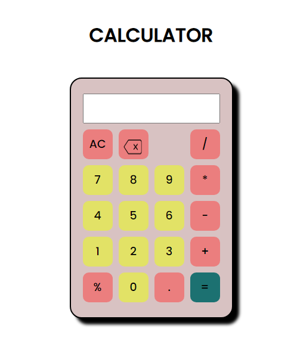

# 🧮 JavaScript Calculator

A simple calculator built using HTML, CSS, and JavaScript to perform basic arithmetic operations

## 🚀 Live Demo
🔗 https://lukman2458.github.io/js-calculator/

## 📸 Preview

## 🛠️ Features
- Perform basic arithmetic operations
- Clean UI using CSS Grid
- Interactive buttons

## 📚 What I Learned
- Creating responsive layouts using CSS Grid
- Handling button events in JavaScript
- Using conditional logic (if-else)
